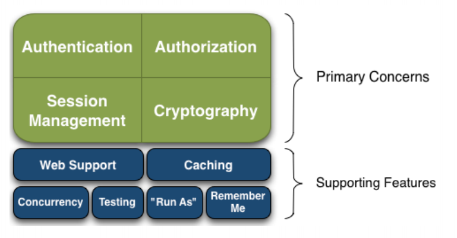
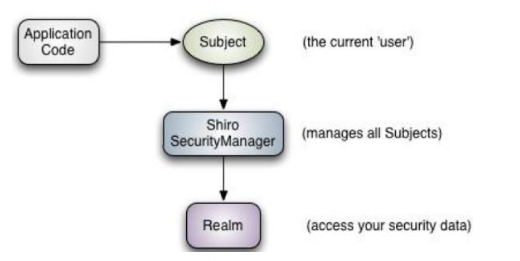
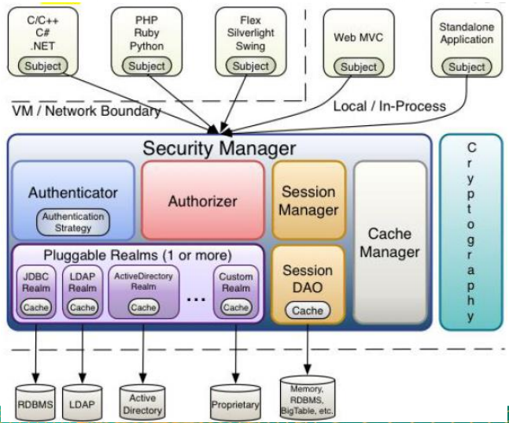
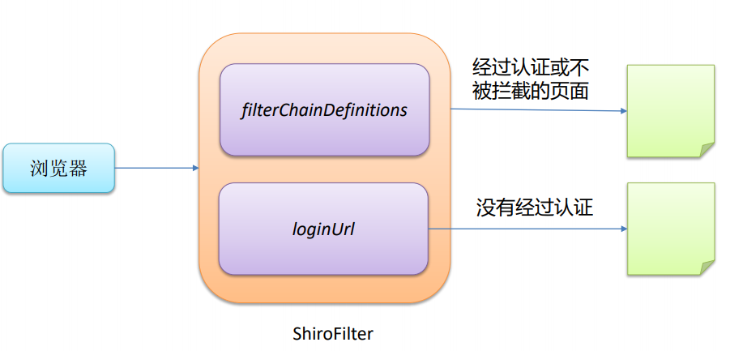
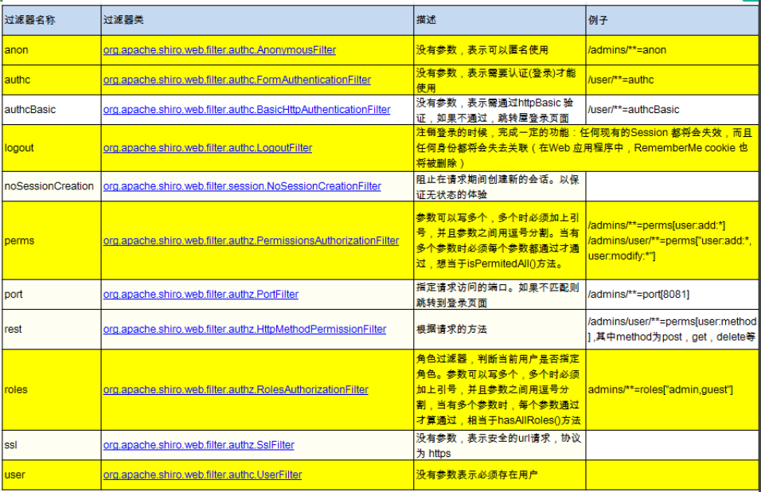

# Shiro

## 简介

​	Apache Shiro 是 Java 的一个安全（权限）框架 。

​	Shiro 可以非常容易的开发出足够好的应用，其不仅可以用在 JavaSE 环境，也可以用在 JavaEE 环境。 

​	Shiro 可以完成：认证、授权、加密、会话管理、与Web 集成、缓存 等。 

​	下载：http://shiro.apache.org/ 

### 功能



- **Authentication**：身份认证/登录，验证用户是不是拥有相应的身份； 
- **Authorization**：授权，即权限验证，验证某个已认证的用户是否拥有某个权限；即判断用 户是否能进行什么操作，如：验证某个用户是否拥有某个角色。或者细粒度的验证某个用户 对某个资源是否具有某个权限； 
-  **Session Manager**：会话管理，即用户登录后就是一次会话，在没有退出之前，它的所有 信息都在会话中；会话可以是普通 JavaSE 环境，也可以是 Web 环境的； 
-  **Cryptography**：加密，保护数据的安全性，如密码加密存储到数据库，而不是明文存储； 
-  **Web Support**：Web 支持，可以非常容易的集成到Web 环境； 
- **Caching**：缓存，比如用户登录后，其用户信息、拥有的角色/权限不必每次去查，这样可 以提高效率；
-  **Concurrency**：Shiro 支持多线程应用的并发验证，即如在一个线程中开启另一个线程，能 • 把权限自动传播过去； 
- **Testing**：提供测试支持； 
-  **Run As**：允许一个用户假装为另一个用户（如果他们允许）的身份进行访问； 
-  **Remember Me**：记住我，这个是非常常见的功能，即一次登录后，下次再来的话不用登 录了 

### Shiro架构

#### 外部

​	从外部来看Shiro ，即从应用程序角度的来观察如何使用 Shiro 完成 工作： 



- Subject：应用代码直接交互的对象是 Subject，也就是说 Shiro 的对外 API 核心就是 Subject。Subject 代表了当前“用户”， 这个用户不一定 是一个具体的人，与当前应用交互的任何东西都是 Subject，如网络爬虫， 机器人等；与 Subject 的所有交互都会委托给 SecurityManager； Subject 其实是一个门面，SecurityManager 才是实际的执行者； 
-  SecurityManager：安全管理器；即所有与安全有关的操作都会与 SecurityManager 交互；且其管理着所有 Subject；可以看出它是 Shiro 的核心，它负责与 Shiro 的其他组件进行交互，它相当于 SpringMVC 中 DispatcherServlet 的角色 
-  Realm：Shiro 从 Realm 获取安全数据（如用户、角色、权限），就是说 SecurityManager 要验证用户身份，那么它需要从 Realm 获取相应的用户 进行比较以确定用户身份是否合法；也需要从 Realm 得到用户相应的角色/ 权限进行验证用户是否能进行操作；可以把 Realm 看成 DataSource 

#### 内部



- Subject：任何可以与应用交互的“用户”；
-  SecurityManager ：相当于SpringMVC 中的 DispatcherServlet；是 Shiro 的心脏； 所有具体的交互都通过 SecurityManager 进行控制；它管理着所有 Subject、且负责进 行认证、授权、会话及缓存的管理。
-  Authenticator：负责 Subject 认证，是一个扩展点，可以自定义实现；可以使用认证 策略（Authentication Strategy），即什么情况下算用户认证通过了；
-  Authorizer：授权器、即访问控制器，用来决定主体是否有权限进行相应的操作；即控 制着用户能访问应用中的哪些功能； 
- Realm：可以有 1 个或多个 Realm，可以认为是安全实体数据源，即用于获取安全实体 的；可以是JDBC 实现，也可以是内存实现等等；由用户提供；所以一般在应用中都需要 实现自己的 Realm；
- SessionManager：管理 Session 生命周期的组件；而 Shiro 并不仅仅可以用在 Web 环境，也可以用在如普通的 JavaSE 环境 
- CacheManager：缓存控制器，来管理如用户、角色、权限等的缓存的；因为这些数据 基本上很少改变，放到缓存中后可以提高访问的性能 
- Cryptography：密码模块，Shwiro 提高了一些常见的加密组件用于如密码加密/解密。 

## QuickStart

​	使用官方source文件中的samples中提供的示例


## 集成Spring

pom.xml

```xml
<project xmlns="http://maven.apache.org/POM/4.0.0" xmlns:xsi="http://www.w3.org/2001/XMLSchema-instance"
  xsi:schemaLocation="http://maven.apache.org/POM/4.0.0 http://maven.apache.org/maven-v4_0_0.xsd">
  <modelVersion>4.0.0</modelVersion>
  <groupId>com.lov</groupId>
  <artifactId>spring-shiro</artifactId>
  <packaging>war</packaging>
  <version>0.0.1-SNAPSHOT</version>
  <name>spring-shiro Maven Webapp</name>
  <url>http://maven.apache.org</url>
  
  
  <properties>
  	<springVersion>5.1.5.RELEASE</springVersion>
  	<shiroVersion>1.4.0</shiroVersion>
  </properties>
  
  <dependencies>
  	<!-- Shiro -->
        <dependency>
            <groupId>org.apache.shiro</groupId>
            <artifactId>shiro-core</artifactId>
            <version>${shiroVersion}</version>
        </dependency>
        <dependency>
            <groupId>org.apache.shiro</groupId>
            <artifactId>shiro-ehcache</artifactId>
          	<version>${shiroVersion}</version>
        </dependency>
        <dependency>
            <groupId>org.apache.shiro</groupId>
            <artifactId>shiro-spring</artifactId>
            <version>${shiroVersion}</version>
        </dependency>
        <dependency>
            <groupId>org.apache.shiro</groupId>
            <artifactId>shiro-web</artifactId>
            <version>${shiroVersion}</version>
        </dependency>
       <!-- logging -->
        <dependency>
            <groupId>org.slf4j</groupId>
            <artifactId>slf4j-log4j12</artifactId>
            <version>1.7.2</version>
            <scope>runtime</scope>
        </dependency>
        <dependency>
            <groupId>org.slf4j</groupId>
            <artifactId>jcl-over-slf4j</artifactId>
            <version>1.7.2</version>
            <scope>runtime</scope>
        </dependency>
        <dependency>
            <groupId>log4j</groupId>
            <artifactId>log4j</artifactId>
            <version>1.2.17</version>
            <scope>runtime</scope>
        </dependency>
        
        <!-- Spring -->
        
        <dependency>
            <groupId>org.springframework</groupId>
            <artifactId>spring-context</artifactId>
            <version>${springVersion}</version>
        </dependency>
        <dependency>
            <groupId>org.springframework</groupId>
            <artifactId>spring-jdbc</artifactId>
            <version>${springVersion}</version>
        </dependency>
        <dependency>
            <groupId>org.springframework</groupId>
            <artifactId>spring-webmvc</artifactId>
            <version>${springVersion}</version>
        </dependency>
       
       
    <dependency>
      <groupId>junit</groupId>
      <artifactId>junit</artifactId>
      <version>3.8.1</version>
      <scope>test</scope>
    </dependency>
  </dependencies>
  <build>
    <finalName>spring-shiro</finalName>
  </build>
</project>

```

web.xml

```xml
<?xml version="1.0" encoding="UTF-8"?>

<web-app xmlns="http://java.sun.com/xml/ns/javaee" xmlns:xsi="http://www.w3.org/2001/XMLSchema-instance"
         xsi:schemaLocation="http://java.sun.com/xml/ns/javaee http://java.sun.com/xml/ns/javaee/web-app_2_5.xsd"
         version="2.5">

    <!-- ==================================================================
         Context parameters
         ================================================================== -->
    <context-param>
        <param-name>contextConfigLocation</param-name>
        <param-value>classpath:applicationContext.xml</param-value>
    </context-param>


    <!-- ==================================================================
         Servlet listeners
         ================================================================== -->

    <listener>
        <listener-class>org.springframework.web.context.ContextLoaderListener</listener-class>
    </listener>

    <!-- ==================================================================
         Filters
         ================================================================== -->
    <!-- Shiro Filter is defined in the spring application context: -->
    <!-- 
    	1.配置Shiro的shiroFilter
    	2、DelegatingFilterProxy实际上是一个filter的一个代理对象。默认情况下，spring会到IOC容器中查找与<filter-name>对应的filter bean。
    		也可以通过targetBeanName的初始化参数来配置filter bean的id
    
     -->
    <filter>
        <filter-name>shiroFilter</filter-name>
        <filter-class>org.springframework.web.filter.DelegatingFilterProxy</filter-class>
        <init-param>
            <param-name>targetFilterLifecycle</param-name>
            <param-value>true</param-value>
        </init-param>

    </filter>

    <filter-mapping>
        <filter-name>shiroFilter</filter-name>
        <url-pattern>/*</url-pattern>
    </filter-mapping>

    <!-- ==================================================================
         Servlets
         ================================================================== -->
    <servlet>
        <servlet-name>spring</servlet-name>
        <servlet-class>org.springframework.web.servlet.DispatcherServlet</servlet-class>
        <load-on-startup>1</load-on-startup>
    </servlet>

    <servlet-mapping>
        <servlet-name>spring</servlet-name>
        <url-pattern>/</url-pattern>
    </servlet-mapping>

    <welcome-file-list>
        <welcome-file>index.jsp</welcome-file>
    </welcome-file-list>

</web-app>

```

applicationContext.xml

```xml
<?xml version="1.0" encoding="UTF-8"?>
<beans xmlns="http://www.springframework.org/schema/beans"
	xmlns:xsi="http://www.w3.org/2001/XMLSchema-instance"
	xsi:schemaLocation="http://www.springframework.org/schema/beans http://www.springframework.org/schema/beans/spring-beans.xsd">

    <!-- =========================================================
         Shiro Core Components - Not Spring Specific
         ========================================================= -->

    <!--  
    1. 配置 SecurityManager!
    -->     
    <bean id="securityManager" class="org.apache.shiro.web.mgt.DefaultWebSecurityManager">
        <property name="cacheManager" ref="cacheManager"/>
        <property name="authenticator" ref="authenticator"></property>
        
        <property name="realms">
        	<list>
    			<ref bean="jdbcRealm"/>
    			<!-- <ref bean="secondRealm"/> -->
    		</list>
        </property>
        
        <property name="rememberMeManager.cookie.maxAge" value="10"></property>
    </bean>

    <!--  
    2. 配置 CacheManager. 
    2.1 需要加入 ehcache 的 jar 包及配置文件. 
    -->     
    <bean id="cacheManager" class="org.apache.shiro.cache.ehcache.EhCacheManager">
        
        <property name="cacheManagerConfigFile" value="classpath:ehcache.xml"/> 
    </bean>
    
    <bean id="authenticator" 
    	class="org.apache.shiro.authc.pam.ModularRealmAuthenticator">
    	<property name="authenticationStrategy">
    		<bean class="org.apache.shiro.authc.pam.AtLeastOneSuccessfulStrategy"></bean>
    	</property>
    </bean>

    <!-- 
    	3. 配置 Realm 
    	3.1 直接配置实现了 org.apache.shiro.realm.Realm 接口的 bean
    -->     
    <bean id="jdbcRealm" class="com.lov.realms.ShiroRealm">
    </bean>
    
    <!-- =========================================================
         Shiro Spring-specific integration
         ========================================================= -->

    <!--  
    4. 配置 LifecycleBeanPostProcessor. 可以自定的来调用配置在 Spring IOC 容器中 shiro bean 的生命周期方法. 
    -->       
    <bean id="lifecycleBeanPostProcessor" class="org.apache.shiro.spring.LifecycleBeanPostProcessor"/>
    <!--  
    5. 启用 IOC 容器中使用 shiro 的注解. 但必须在配置了 LifecycleBeanPostProcessor 之后才可以使用. 
    -->     
    <bean class="org.springframework.aop.framework.autoproxy.DefaultAdvisorAutoProxyCreator"
          depends-on="lifecycleBeanPostProcessor"/>
    <bean class="org.apache.shiro.spring.security.interceptor.AuthorizationAttributeSourceAdvisor">
        <property name="securityManager" ref="securityManager"/>
    </bean>

    <!--  
    6. 配置 Shiroilter. 
    6.1 id 必须和 web.xml 文件中配置的 DelegatingFilterProxy 的 <filter-name> 一致.
                      若不一致, 则会抛出: NoSuchBeanDefinitionException. 因为 Shiro 会来 IOC 容器中查找和 <filter-name> 名字对应的 filter bean.
    -->     
    <bean id="shiroFilter" class="org.apache.shiro.spring.web.ShiroFilterFactoryBean">
        <property name="securityManager" ref="securityManager"/>
        <property name="loginUrl" value="/login.jsp"/>
        <property name="successUrl" value="/list.jsp"/>
        <property name="unauthorizedUrl" value="/unauthorized.jsp"/>
       
        <!--  
        	配置哪些页面需要受保护. 
        	以及访问这些页面需要的权限. 
        	1). anon 可以被匿名访问
        	2). authc 必须认证(即登录)后才可能访问的页面. 
        	3). logout 登出.
        	4). roles 角色过滤器
        -->

        <property name="filterChainDefinitions">
            <value>
                /login.jsp = anon
                /shiro/login = anon
                /shiro/logout = logout
                
                /user.jsp = roles[user]
                /admin.jsp = roles[admin]
                
                # everything else requires authentication:
                /** = authc
            </value>
        </property>

    </bean>

</beans>

```

ehcache.xml

```xml

<ehcache>
    <diskStore path="java.io.tmpdir/shiro-spring-sample"/>
   <defaultCache
            maxElementsInMemory="10000"
            eternal="false"
            timeToIdleSeconds="120"
            timeToLiveSeconds="120"
            overflowToDisk="false"
            diskPersistent="false"
            diskExpiryThreadIntervalSeconds="120"
            />
    <cache name="shiro-activeSessionCache"
           maxElementsInMemory="10000"
           eternal="true"
           overflowToDisk="true"
           diskPersistent="true"
           diskExpiryThreadIntervalSeconds="600"/>
    <cache name="org.apache.shiro.realm.SimpleAccountRealm.authorization"
           maxElementsInMemory="100"
           eternal="false"
           timeToLiveSeconds="600"
           overflowToDisk="false"/>
</ehcache>

```

spring-servlet.xml

```xml
<?xml version="1.0" encoding="UTF-8"?>
<beans xmlns="http://www.springframework.org/schema/beans"
	xmlns:xsi="http://www.w3.org/2001/XMLSchema-instance"
	xmlns:mvc="http://www.springframework.org/schema/mvc"
	xmlns:context="http://www.springframework.org/schema/context"
	xsi:schemaLocation="http://www.springframework.org/schema/mvc http://www.springframework.org/schema/mvc/spring-mvc-4.0.xsd
		http://www.springframework.org/schema/beans http://www.springframework.org/schema/beans/spring-beans.xsd
		http://www.springframework.org/schema/context http://www.springframework.org/schema/context/spring-context-4.0.xsd">
	
	<context:component-scan base-package="com.lov"></context:component-scan>
	
	<bean class="org.springframework.web.servlet.view.InternalResourceViewResolver">
		<property name="prefix" value="/"></property>
		<property name="suffix" value=".jsp"></property>
	</bean>
	
	<mvc:annotation-driven></mvc:annotation-driven>
	<mvc:default-servlet-handler/>

</beans>

```

```java
public class ShiroRealm  implements Realm{
```

### Web集成

- Shiro 提供了与 Web 集成的支持，其通过一个 ShiroFilter 入口来拦截需要安全控制的URL，然后 进行相应的控制 
-  ShiroFilter 类似于如 Strut2/SpringMVC 这种 web 框架的前端控制器，是安全控制的入口点，其 负责读取配置（如ini 配置文件），然后判断URL 是否需要登录/权限等工作。 

### ShiroFilter

​	DelegatingFilterProxy 作用是自动到 Spring 容器查找名 字为 shiroFilter（filter-name）的 bean 并把所有 Filter 的操作委托给它。 



DelegatingFilterProxy.java

```java
	/**
	 * Set the name of the target bean in the Spring application context.
	 * The target bean must implement the standard Servlet Filter interface.
	 * <p>By default, the {@code filter-name} as specified for the
	 * DelegatingFilterProxy in {@code web.xml} will be used.
	 */
	public void setTargetBeanName(@Nullable String targetBeanName) {
		this.targetBeanName = targetBeanName;
	}
```


### filterChainDefinitions

- [urls] 部分的配置，其格式是： “url=拦截器[参数]，拦截 器[参数]”；
-  如果当前请求的 url 匹配 [urls] 部分的某个 url 模式，将会 执行其配置的拦截器。
-  anon（anonymous） 拦截器表示匿名访问（即不需要登 录即可访问） 
-  authc （authentication）拦截器表示需要身份认证通过后 才能访问 



### URL匹配模式

- url 模式使用 Ant 风格模式 

- Ant 路径通配符支持 ?、 *、 **，注意通配符匹配不 包括目录分隔符“/”：

   – ?：匹配一个字符，如 /admin? 将匹配 /admin1，但不 匹配 /admin 或 /admin/； 

  – *：匹配零个或多个字符串，如 /admin 将匹配 /admin、 /admin123，但不匹配 /admin/1；

   –** ：匹配路径中的零个或多个路径，如 /admin/** 将匹 配 /admin/a 或 /admin/a/b 

### URL匹配顺序

- URL 权限采取第一次匹配优先的方式，即从头开始 使用第一个匹配的 url 模式对应的拦截器链。 

-  如： 

  – /bb/\**=filter1 

  – /bb/aa=filter2 

  – /**=filter3 

  – 如果请求的url是“/bb/aa”，因为按照声明顺序进行匹 配，那么将使用 filter1 进行拦截。 

## 认证

## 授权

## 会话管理

## 缓存

## RemberMe