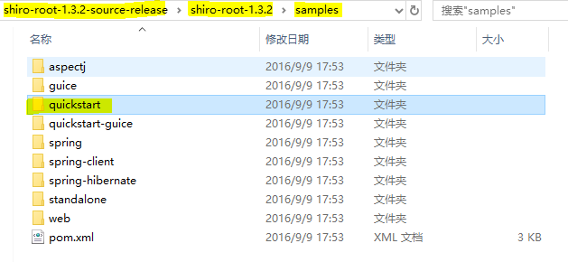

# Shiro

## 简介

​	Apache Shiro 是 Java 的一个安全（权限）框架 。

​	Shiro 可以非常容易的开发出足够好的应用，其不仅可以用在 JavaSE 环境，也可以用在 JavaEE 环境。 

​	Shiro 可以完成：认证、授权、加密、会话管理、与Web 集成、缓存 等。 

​	下载：http://shiro.apache.org/ 

### 功能


- **Authentication**：身份认证/登录，验证用户是不是拥有相应的身份； 
- **Authorization**：授权，即权限验证，验证某个已认证的用户是否拥有某个权限；即判断用 户是否能进行什么操作，如：验证某个用户是否拥有某个角色。或者细粒度的验证某个用户 对某个资源是否具有某个权限； 
-  **Session Manager**：会话管理，即用户登录后就是一次会话，在没有退出之前，它的所有 信息都在会话中；会话可以是普通 JavaSE 环境，也可以是 Web 环境的； 
-  **Cryptography**：加密，保护数据的安全性，如密码加密存储到数据库，而不是明文存储； 
-  **Web Support**：Web 支持，可以非常容易的集成到Web 环境； 
- **Caching**：缓存，比如用户登录后，其用户信息、拥有的角色/权限不必每次去查，这样可 以提高效率；
-  **Concurrency**：Shiro 支持多线程应用的并发验证，即如在一个线程中开启另一个线程，能 • 把权限自动传播过去； 
- **Testing**：提供测试支持； 
-  **Run As**：允许一个用户假装为另一个用户（如果他们允许）的身份进行访问； 
-  **Remember Me**：记住我，这个是非常常见的功能，即一次登录后，下次再来的话不用登 录了 

### Shiro架构

#### 外部

​	从外部来看Shiro ，即从应用程序角度的来观察如何使用 Shiro 完成 工作： 


- Subject：应用代码直接交互的对象是 Subject，也就是说 Shiro 的对外 API 核心就是 Subject。Subject 代表了当前“用户”， 这个用户不一定 是一个具体的人，与当前应用交互的任何东西都是 Subject，如网络爬虫， 机器人等；与 Subject 的所有交互都会委托给 SecurityManager； Subject 其实是一个门面，SecurityManager 才是实际的执行者； 
-  SecurityManager：安全管理器；即所有与安全有关的操作都会与 SecurityManager 交互；且其管理着所有 Subject；可以看出它是 Shiro 的核心，它负责与 Shiro 的其他组件进行交互，它相当于 SpringMVC 中 DispatcherServlet 的角色 
-  Realm：Shiro 从 Realm 获取安全数据（如用户、角色、权限），就是说 SecurityManager 要验证用户身份，那么它需要从 Realm 获取相应的用户 进行比较以确定用户身份是否合法；也需要从 Realm 得到用户相应的角色/ 权限进行验证用户是否能进行操作；可以把 Realm 看成 DataSource 

#### 内部


- Subject：任何可以与应用交互的“用户”；
-  SecurityManager ：相当于SpringMVC 中的 DispatcherServlet；是 Shiro 的心脏； 所有具体的交互都通过 SecurityManager 进行控制；它管理着所有 Subject、且负责进 行认证、授权、会话及缓存的管理。
-  Authenticator：负责 Subject 认证，是一个扩展点，可以自定义实现；可以使用认证 策略（Authentication Strategy），即什么情况下算用户认证通过了；
-  Authorizer：授权器、即访问控制器，用来决定主体是否有权限进行相应的操作；即控 制着用户能访问应用中的哪些功能； 
- Realm：可以有 1 个或多个 Realm，可以认为是安全实体数据源，即用于获取安全实体 的；可以是JDBC 实现，也可以是内存实现等等；由用户提供；所以一般在应用中都需要 实现自己的 Realm；
- SessionManager：管理 Session 生命周期的组件；而 Shiro 并不仅仅可以用在 Web 环境，也可以用在如普通的 JavaSE 环境 
- CacheManager：缓存控制器，来管理如用户、角色、权限等的缓存的；因为这些数据 基本上很少改变，放到缓存中后可以提高访问的性能 
- Cryptography：密码模块，Shwiro 提高了一些常见的加密组件用于如密码加密/解密。 

## QuickStart

​	使用官方source文件中的samples中提供的示例



## 集成Spring

pom.xml

```xml
<project xmlns="http://maven.apache.org/POM/4.0.0" xmlns:xsi="http://www.w3.org/2001/XMLSchema-instance"
  xsi:schemaLocation="http://maven.apache.org/POM/4.0.0 http://maven.apache.org/maven-v4_0_0.xsd">
  <modelVersion>4.0.0</modelVersion>
  <groupId>com.lov</groupId>
  <artifactId>spring-shiro</artifactId>
  <packaging>war</packaging>
  <version>0.0.1-SNAPSHOT</version>
  <name>spring-shiro Maven Webapp</name>
  <url>http://maven.apache.org</url>
  
  
  <properties>
  	<springVersion>5.1.5.RELEASE</springVersion>
  	<shiroVersion>1.4.0</shiroVersion>
  </properties>
  
  <dependencies>
  	<!-- Shiro -->
        <dependency>
            <groupId>org.apache.shiro</groupId>
            <artifactId>shiro-core</artifactId>
            <version>${shiroVersion}</version>
        </dependency>
        <dependency>
            <groupId>org.apache.shiro</groupId>
            <artifactId>shiro-ehcache</artifactId>
          	<version>${shiroVersion}</version>
        </dependency>
        <dependency>
            <groupId>org.apache.shiro</groupId>
            <artifactId>shiro-spring</artifactId>
            <version>${shiroVersion}</version>
        </dependency>
        <dependency>
            <groupId>org.apache.shiro</groupId>
            <artifactId>shiro-web</artifactId>
            <version>${shiroVersion}</version>
        </dependency>
       <!-- logging -->
        <dependency>
            <groupId>org.slf4j</groupId>
            <artifactId>slf4j-log4j12</artifactId>
            <version>1.7.2</version>
            <scope>runtime</scope>
        </dependency>
        <dependency>
            <groupId>org.slf4j</groupId>
            <artifactId>jcl-over-slf4j</artifactId>
            <version>1.7.2</version>
            <scope>runtime</scope>
        </dependency>
        <dependency>
            <groupId>log4j</groupId>
            <artifactId>log4j</artifactId>
            <version>1.2.17</version>
            <scope>runtime</scope>
        </dependency>
        
        <!-- Spring -->
        
        <dependency>
            <groupId>org.springframework</groupId>
            <artifactId>spring-context</artifactId>
            <version>${springVersion}</version>
        </dependency>
        <dependency>
            <groupId>org.springframework</groupId>
            <artifactId>spring-jdbc</artifactId>
            <version>${springVersion}</version>
        </dependency>
        <dependency>
            <groupId>org.springframework</groupId>
            <artifactId>spring-webmvc</artifactId>
            <version>${springVersion}</version>
        </dependency>
       
       
    <dependency>
      <groupId>junit</groupId>
      <artifactId>junit</artifactId>
      <version>3.8.1</version>
      <scope>test</scope>
    </dependency>
  </dependencies>
  <build>
    <finalName>spring-shiro</finalName>
  </build>
</project>

```

web.xml

```xml
<?xml version="1.0" encoding="UTF-8"?>

<web-app xmlns="http://java.sun.com/xml/ns/javaee" xmlns:xsi="http://www.w3.org/2001/XMLSchema-instance"
         xsi:schemaLocation="http://java.sun.com/xml/ns/javaee http://java.sun.com/xml/ns/javaee/web-app_2_5.xsd"
         version="2.5">

    <!-- ==================================================================
         Context parameters
         ================================================================== -->
    <context-param>
        <param-name>contextConfigLocation</param-name>
        <param-value>classpath:applicationContext.xml</param-value>
    </context-param>


    <!-- ==================================================================
         Servlet listeners
         ================================================================== -->

    <listener>
        <listener-class>org.springframework.web.context.ContextLoaderListener</listener-class>
    </listener>

    <!-- ==================================================================
         Filters
         ================================================================== -->
    <!-- Shiro Filter is defined in the spring application context: -->
    <!-- 
    	1.配置Shiro的shiroFilter
    	2、DelegatingFilterProxy实际上是一个filter的一个代理对象。默认情况下，spring会到IOC容器中查找与<filter-name>对应的filter bean。
    		也可以通过targetBeanName的初始化参数来配置filter bean的id
    
     -->
    <filter>
        <filter-name>shiroFilter</filter-name>
        <filter-class>org.springframework.web.filter.DelegatingFilterProxy</filter-class>
        <init-param>
            <param-name>targetFilterLifecycle</param-name>
            <param-value>true</param-value>
        </init-param>

    </filter>

    <filter-mapping>
        <filter-name>shiroFilter</filter-name>
        <url-pattern>/*</url-pattern>
    </filter-mapping>

    <!-- ==================================================================
         Servlets
         ================================================================== -->
    <servlet>
        <servlet-name>spring</servlet-name>
        <servlet-class>org.springframework.web.servlet.DispatcherServlet</servlet-class>
        <load-on-startup>1</load-on-startup>
    </servlet>

    <servlet-mapping>
        <servlet-name>spring</servlet-name>
        <url-pattern>/</url-pattern>
    </servlet-mapping>

    <welcome-file-list>
        <welcome-file>index.jsp</welcome-file>
    </welcome-file-list>

</web-app>

```

applicationContext.xml

```xml
<?xml version="1.0" encoding="UTF-8"?>
<beans xmlns="http://www.springframework.org/schema/beans"
	xmlns:xsi="http://www.w3.org/2001/XMLSchema-instance"
	xsi:schemaLocation="http://www.springframework.org/schema/beans http://www.springframework.org/schema/beans/spring-beans.xsd">

    <!-- =========================================================
         Shiro Core Components - Not Spring Specific
         ========================================================= -->

    <!--  
    1. 配置 SecurityManager!
    -->     
    <bean id="securityManager" class="org.apache.shiro.web.mgt.DefaultWebSecurityManager">
        <property name="cacheManager" ref="cacheManager"/>
        <property name="authenticator" ref="authenticator"></property>
        
        <property name="realms">
        	<list>
    			<ref bean="jdbcRealm"/>
    			<!-- <ref bean="secondRealm"/> -->
    		</list>
        </property>
        
        <property name="rememberMeManager.cookie.maxAge" value="10"></property>
    </bean>

    <!--  
    2. 配置 CacheManager. 
    2.1 需要加入 ehcache 的 jar 包及配置文件. 
    -->     
    <bean id="cacheManager" class="org.apache.shiro.cache.ehcache.EhCacheManager">
        
        <property name="cacheManagerConfigFile" value="classpath:ehcache.xml"/> 
    </bean>
    
    <bean id="authenticator" 
    	class="org.apache.shiro.authc.pam.ModularRealmAuthenticator">
    	<property name="authenticationStrategy">
    		<bean class="org.apache.shiro.authc.pam.AtLeastOneSuccessfulStrategy"></bean>
    	</property>
    </bean>

    <!-- 
    	3. 配置 Realm 
    	3.1 直接配置实现了 org.apache.shiro.realm.Realm 接口的 bean
    -->     
    <bean id="jdbcRealm" class="com.lov.realms.ShiroRealm">
    </bean>
    
    <!-- =========================================================
         Shiro Spring-specific integration
         ========================================================= -->

    <!--  
    4. 配置 LifecycleBeanPostProcessor. 可以自定的来调用配置在 Spring IOC 容器中 shiro bean 的生命周期方法. 
    -->       
    <bean id="lifecycleBeanPostProcessor" class="org.apache.shiro.spring.LifecycleBeanPostProcessor"/>
    <!--  
    5. 启用 IOC 容器中使用 shiro 的注解. 但必须在配置了 LifecycleBeanPostProcessor 之后才可以使用. 
    -->     
    <bean class="org.springframework.aop.framework.autoproxy.DefaultAdvisorAutoProxyCreator"
          depends-on="lifecycleBeanPostProcessor"/>
    <bean class="org.apache.shiro.spring.security.interceptor.AuthorizationAttributeSourceAdvisor">
        <property name="securityManager" ref="securityManager"/>
    </bean>

    <!--  
    6. 配置 Shiroilter. 
    6.1 id 必须和 web.xml 文件中配置的 DelegatingFilterProxy 的 <filter-name> 一致.
                      若不一致, 则会抛出: NoSuchBeanDefinitionException. 因为 Shiro 会来 IOC 容器中查找和 <filter-name> 名字对应的 filter bean.
    -->     
    <bean id="shiroFilter" class="org.apache.shiro.spring.web.ShiroFilterFactoryBean">
        <property name="securityManager" ref="securityManager"/>
        <property name="loginUrl" value="/login.jsp"/>
        <property name="successUrl" value="/list.jsp"/>
        <property name="unauthorizedUrl" value="/unauthorized.jsp"/>
       
        <!--  
        	配置哪些页面需要受保护. 
        	以及访问这些页面需要的权限. 
        	1). anon 可以被匿名访问
        	2). authc 必须认证(即登录)后才可能访问的页面. 
        	3). logout 登出.
        	4). roles 角色过滤器
        -->

        <property name="filterChainDefinitions">
            <value>
                /login.jsp = anon
                /shiro/login = anon
                /shiro/logout = logout
                
                /user.jsp = roles[user]
                /admin.jsp = roles[admin]
                
                # everything else requires authentication:
                /** = authc
            </value>
        </property>

    </bean>

</beans>

```

ehcache.xml

```xml

<ehcache>
    <diskStore path="java.io.tmpdir/shiro-spring-sample"/>
   <defaultCache
            maxElementsInMemory="10000"
            eternal="false"
            timeToIdleSeconds="120"
            timeToLiveSeconds="120"
            overflowToDisk="false"
            diskPersistent="false"
            diskExpiryThreadIntervalSeconds="120"
            />
    <cache name="shiro-activeSessionCache"
           maxElementsInMemory="10000"
           eternal="true"
           overflowToDisk="true"
           diskPersistent="true"
           diskExpiryThreadIntervalSeconds="600"/>
    <cache name="org.apache.shiro.realm.SimpleAccountRealm.authorization"
           maxElementsInMemory="100"
           eternal="false"
           timeToLiveSeconds="600"
           overflowToDisk="false"/>
</ehcache>

```

spring-servlet.xml

```xml
<?xml version="1.0" encoding="UTF-8"?>
<beans xmlns="http://www.springframework.org/schema/beans"
	xmlns:xsi="http://www.w3.org/2001/XMLSchema-instance"
	xmlns:mvc="http://www.springframework.org/schema/mvc"
	xmlns:context="http://www.springframework.org/schema/context"
	xsi:schemaLocation="http://www.springframework.org/schema/mvc http://www.springframework.org/schema/mvc/spring-mvc-4.0.xsd
		http://www.springframework.org/schema/beans http://www.springframework.org/schema/beans/spring-beans.xsd
		http://www.springframework.org/schema/context http://www.springframework.org/schema/context/spring-context-4.0.xsd">
	
	<context:component-scan base-package="com.lov"></context:component-scan>
	
	<bean class="org.springframework.web.servlet.view.InternalResourceViewResolver">
		<property name="prefix" value="/"></property>
		<property name="suffix" value=".jsp"></property>
	</bean>
	
	<mvc:annotation-driven></mvc:annotation-driven>
	<mvc:default-servlet-handler/>

</beans>

```

```java
public class ShiroRealm  implements Realm{
```

### Web集成

- Shiro 提供了与 Web 集成的支持，其通过一个 ShiroFilter 入口来拦截需要安全控制的URL，然后 进行相应的控制 
-  ShiroFilter 类似于如 Strut2/SpringMVC 这种 web 框架的前端控制器，是安全控制的入口点，其 负责读取配置（如ini 配置文件），然后判断URL 是否需要登录/权限等工作。 

### ShiroFilter

​	DelegatingFilterProxy 作用是自动到 Spring 容器查找名 字为 shiroFilter（filter-name）的 bean 并把所有 Filter 的操作委托给它。 


DelegatingFilterProxy.java

```java
	/**
	 * Set the name of the target bean in the Spring application context.
	 * The target bean must implement the standard Servlet Filter interface.
	 * <p>By default, the {@code filter-name} as specified for the
	 * DelegatingFilterProxy in {@code web.xml} will be used.
	 */
	public void setTargetBeanName(@Nullable String targetBeanName) {
		this.targetBeanName = targetBeanName;
	}
```


### filterChainDefinitions

- [urls] 部分的配置，其格式是： “url=拦截器[参数]，拦截 器[参数]”；
-  如果当前请求的 url 匹配 [urls] 部分的某个 url 模式，将会 执行其配置的拦截器。
-  anon（anonymous） 拦截器表示匿名访问（即不需要登 录即可访问） 
-  authc （authentication）拦截器表示需要身份认证通过后 才能访问 


### URL匹配模式

- url 模式使用 Ant 风格模式 

- Ant 路径通配符支持 ?、 *、 **，注意通配符匹配不 包括目录分隔符“/”：

   – ?：匹配一个字符，如 /admin? 将匹配 /admin1，但不 匹配 /admin 或 /admin/； 

  – *：匹配零个或多个字符串，如 /admin 将匹配 /admin、 /admin123，但不匹配 /admin/1；

   –** ：匹配路径中的零个或多个路径，如 /admin/** 将匹 配 /admin/a 或 /admin/a/b 

### URL匹配顺序

- URL 权限采取第一次匹配优先的方式，即从头开始 使用第一个匹配的 url 模式对应的拦截器链。 

-  如： 

  – /bb/\**=filter1 

  – /bb/aa=filter2 

  – /**=filter3 

  – 如果请求的url是“/bb/aa”，因为按照声明顺序进行匹 配，那么将使用 filter1 进行拦截。 

## 认证

### Shiro外部架构


### 认证思路分析

1. 获取当前的 Subject. 调用 SecurityUtils.getSubject();
2. 测试当前的用户是否已经被认证. 即是否已经登录. 调用 Subject 的 isAuthenticated() 
3. 若没有被认证, 则把用户名和密码封装为 UsernamePasswordToken 对象
  1). 创建一个表单页面
  2). 把请求提交到 SpringMVC 的 Handler
  3). 获取用户名和密码. 
4. 执行登录: 调用 Subject 的 login(AuthenticationToken) 方法. 
5. 自定义 Realm 的方法, 从数据库中获取对应的记录, 返回给 Shiro.
  1). 实际上需要继承 org.apache.shiro.realm.AuthenticatingRealm 类
  2). 实现 doGetAuthenticationInfo(AuthenticationToken) 方法. 
6. 由 shiro 完成对密码的比对. 

### 认证流程

1、首先调用 Subject.login(token) 进行登录，其会自动委托给 SecurityManager 

2、SecurityManager 负责真正的身份验证逻辑；它会委托给 Authenticator 进行身份验证； 

3、Authenticator 才是真正的身份验证者，Shiro API 中核心的身份 认证入口点，此处可以自定义插入自己的实现； 

4、Authenticator 可能会委托给相应的 AuthenticationStrategy 进 行多 Realm 身份验证，默认 ModularRealmAuthenticator 会调用 AuthenticationStrategy 进行多 Realm 身份验证； 

5、Authenticator 会把相应的 token 传入 Realm，从 Realm 获取 身份验证信息，如果没有返回/抛出异常表示身份验证失败了。此处 可以配置多个Realm，将按照相应的顺序及策略进行访问。 


### Realm

​	**Realm**：**Shiro** 从 **Realm** 获取安全数据（如用户、角色、 权限），即 **SecurityManager** 要验证用户身份，那么它需 要从 **Realm** 获取相应的用户进行比较以确定用户身份是否 合法；也需要从**Realm**得到用户相应的角色/权限进行验证 用户是否能进行操作。

​	一般继承 **AuthorizingRealm**（授权）即可；其继承了**AuthenticatingRealm**（即身份验证），而且也间接继承了**CachingRealm**（带有缓存实现）

### Authenticator 

​	**Authenticator** 的职责是验证用户帐号，是 Shiro API 中身份验证**核心的入口点**：如果验证成功，将返回**AuthenticationInfo** 验证信息；此信息中包含了身份及凭证；如果验证失败将抛出相应 的 **AuthenticationException** 异常 

​	 **SecurityManager** 接口继承了 **Authenticator**，另外还有一个 **ModularRealmAuthenticator**实现，其委托给多个**Realm** 进行 验证，验证规则通过 **AuthenticationStrategy** 接口指定 

### AuthenticationStrategy 

​	**AuthenticationStrategy** 接口的默认实现（认证策略）：

- **FirstSuccessfulStrategy**：只要有一个 Realm 验证成功即可，只返回第 一个 Realm 身份验证成功的认证信息，其他的忽略； 
-  **AtLeastOneSuccessfulStrategy**：只要有一个Realm验证成功即可，和 FirstSuccessfulStrategy 不同，将返回所有Realm身份验证成功的认证信 息；
-  **AllSuccessfulStrategy**：所有Realm验证成功才算成功，且返回所有 Realm身份验证成功的认证信息，如果有一个失败就失败了。 
- **ModularRealmAuthenticator** 默认是 AtLeastOneSuccessfulStrategy 策略 

### 实现认证

​	以集成spring时的代码为基础：

ShiroController.java

```java
@Controller
@RequestMapping("/shiro")
public class ShiroController {

	@RequestMapping("/login")
	public String shiroLogin(@RequestParam("username") String username,@RequestParam("password") String password){
		//获取Subject
        Subject currentUser = SecurityUtils.getSubject();
		//认证
		if (!currentUser.isAuthenticated()) {
			UsernamePasswordToken token = new UsernamePasswordToken(username, password);
			token.setRememberMe(true);
			
			try {
                //可断点跟踪
                //这里传入的token会传到配置的realm中
				currentUser.login(token);
			} catch (AuthenticationException e) {
				System.out.println("login filed:"+e.getMessage());
			}
		}
		
		return "redirect:/list.jsp";
	}
	
}
```

ShiroRealm.java

```java
//继承AuthenticatingRealm，而不是实现Realm
public class ShiroRealm  extends AuthenticatingRealm{

	@Override
	protected AuthenticationInfo doGetAuthenticationInfo(AuthenticationToken token) throws AuthenticationException {
//		System.out.println("doGetAuthenticationInfo:"+token);
		//1、将AuthenticationToken强转为UsernamePasswordToken
		UsernamePasswordToken upToken = (UsernamePasswordToken)token;
		//2、获取username
		String username =  upToken.getUsername();
		//3、数据库查询
		System.out.println("从数据库获取"+username+"的信息");
		//4、异常检测
		if ("unknown".equals(username)) {
			throw new UnknownAccountException("user not exist");
		}
		if ("master".equals(username)) {
			throw new LockedAccountException("user been locked");
		}
		
		//5、根据用户情况，构建AuthenticationInfo对象并返回，通常使用SimpleAuthenticationInfo
		//认证实体信息
		Object principal = username;
		//密码
		Object credentials  = "000";
		//当前realm对象的name
		String realmName = getName();
		
		SimpleAuthenticationInfo info = new SimpleAuthenticationInfo(principal, credentials, realmName);
		
		return info;
	}

}
```

​	对应特定的路径访问，都需要在shiro的url拦截链中注册单独的访问权限；对于登录的用户，都会有用户缓存，不会再调用realm中的方法；只有通过logout登出`<a href="shiro/logout">logout</a>`

### 密码对比

​	在UsernamePasswordToken的getPassword方法打断点，因为进行密码对比，一定会调用该方法


```java
//主要在该类的doCredentialsMatch方法中进行比较
SimpleCredentialsMatcher.java

public boolean doCredentialsMatch(AuthenticationToken token, AuthenticationInfo info) {
        Object tokenCredentials = getCredentials(token);
        Object accountCredentials = getCredentials(info);
        return equals(tokenCredentials, accountCredentials);
    }
```

```java
//AuthenticatingRealm抽象类中的assertCredentialsMatch方法，获取matcher并调用
AuthenticatingRealm.java

protected void assertCredentialsMatch(AuthenticationToken token, AuthenticationInfo info) throws AuthenticationException {
        CredentialsMatcher cm = getCredentialsMatcher();
        if (cm != null) {
            if (!cm.doCredentialsMatch(token, info)) {
                //not successful - throw an exception to indicate this:
                String msg = "Submitted credentials for token [" + token + "] did not match the expected credentials.";
                throw new IncorrectCredentialsException(msg);
            }
        } else {
            throw new AuthenticationException("A CredentialsMatcher must be configured in order to verify " +
                    "credentials during authentication.  If you do not wish for credentials to be examined, you " +
                    "can configure an " + AllowAllCredentialsMatcher.class.getName() + " instance.");
        }
    }
```

### MD5加密

配置realm的credentialsMatcher属性

```xml
 <bean id="jdbcRealm" class="com.lov.realms.ShiroRealm">
   		<property name="credentialsMatcher">
			  <bean class="org.apache.shiro.authc.credential.HashedCredentialsMatcher">
    			<property name="hashAlgorithmName" value="MD5"></property>
    			<!-- 加密次数 -->
    			<property name="hashIterations" value="1024"></property>
    		</bean> 			
   		</property>
    </bean>
```

断点分析：

```java
//配置后使用HashedCredentialsMatcher
HashedCredentialsMatcher.java
---------------------doCredentialsMatch
@Override
    public boolean doCredentialsMatch(AuthenticationToken token, AuthenticationInfo info) {
        Object tokenHashedCredentials = hashProvidedCredentials(token, info);
        Object accountCredentials = getCredentials(info);
        return equals(tokenHashedCredentials, accountCredentials);
    }
---------------------hashProvidedCredentials
protected Object hashProvidedCredentials(AuthenticationToken token, AuthenticationInfo info) {
        Object salt = null;
        if (info instanceof SaltedAuthenticationInfo) {
            salt = ((SaltedAuthenticationInfo) info).getCredentialsSalt();
        } else {
            //retain 1.0 backwards compatibility:
            if (isHashSalted()) {
                salt = getSalt(token);
            }
        }
        return hashProvidedCredentials(token.getCredentials(), salt, getHashIterations());
    }
---------------------hashProvidedCredentials 
  protected Hash hashProvidedCredentials(Object credentials, Object salt, int hashIterations) {
        String hashAlgorithmName = assertHashAlgorithmName();
        return new SimpleHash(hashAlgorithmName, credentials, salt, hashIterations);
    }
```

#### MD5盐值加密

​	防止不同用户相同密码时，加密的结果也一样

```java
Object principal = username;
		//密码
		Object credentials = null;
		if (username.equals("user")) {
			credentials = "2bbffae8c52dd2532dfe629cecfb2c85";
		}else if (username.equals("admin")) {
			credentials = "c41d7c66e1b8404545aa3a0ece2006ac";
		} 
		//当前realm对象的name
		String realmName = getName();
		
		SimpleAuthenticationInfo info = null;//new SimpleAuthenticationInfo(principal, credentials, realmName);
		
		ByteSource credentialsSalt = ByteSource.Util.bytes(username);
		info = new SimpleAuthenticationInfo(principal, credentials, credentialsSalt , realmName);
```

​	将传入token，加上从info中传入的salt值进行加密，再与info中的（从数据库查出的密码）credentials进行比较

### 多realm

```xml
<!--  
    1. 配置 SecurityManager!
    -->     
    <bean id="securityManager" class="org.apache.shiro.web.mgt.DefaultWebSecurityManager">
        <property name="cacheManager" ref="cacheManager"/>
        <property name="authenticator" ref="authenticator"></property>
        <!-- 该属性最后会被设置到ModularRealmAuthenticator类中 -->
        <property name="realms">
        	<list>
    			<ref bean="jdbcRealm"/>
    			<ref bean="secondRealm"/>
    		</list>
        </property>
        
        <property name="rememberMeManager.cookie.maxAge" value="10"></property>
    </bean>
 ........................................

<!-- 当有多个realm时，配置该bean -->
    <bean id="authenticator" 
    	class="org.apache.shiro.authc.pam.ModularRealmAuthenticator">
    	<property name="authenticationStrategy">
    		<!-- 更改多realm的认证策略 -->
    		<bean class="org.apache.shiro.authc.pam.AtLeastOneSuccessfulStrategy"></bean>
    	</property>
        <!--
		可以直接在SecurityManager中设置
        <property name="realms">
        	<list>
    			<ref bean="jdbcRealm"/>
    			<ref bean="secondRealm"/>
    		</list>
        </property> -->
    </bean>
```

## 授权

- **授权**，也叫==访问控制，即在应用中控制谁访问哪些资源==（如访问页面/编辑数据/页面操作 等）。在授权中需了解的几个关键对象：主体（Subject）、资源（Resource）、权限 （Permission）、角色（Role）。 
- **主体(Subject)**：访问应用的用户，在 Shiro 中使用 Subject 代表该用户。用户只有授权 后才允许访问相应的资源。 
- **资源(Resource)**：==在应用中用户可以访问的 URL==，比如访问 JSP 页面、查看/编辑某些 数据、访问某个业务方法、打印文本等等都是资源。用户只要授权后才能访问。 
- **权限(Permission)**：安全策略中的原子授权单位，通过权限我们可以表示在应用中用户 有没有操作某个资源的权力。即==权限表示在应用中用户能不能访问某个资源==，如：访问用 户列表页面查看/新增/修改/删除用户数据（即很多时候都是CRUD（增查改删）式权限控 制）等。权限代表了用户有没有操作某个资源的权利，即反映在某个资源上的操作允不允 许。 
- Shiro 支持粗粒度权限（如用户模块的所有权限）和细粒度权限（操作某个用户的权限， 即实例级别的） 
- **角色(Role)**：==权限的集合==，一般情况下会赋予用户角色而不是权限，即这样用户可以拥有 一组权限，赋予权限时比较方便。典型的如：项目经理、技术总监、CTO、开发工程师等 都是角色，不同的角色拥有一组不同的权限。 

### 授权方式

- **编程式**：通过写if/else 授权代码块完成 

  ```java
  if(subject.hasRole("admin")){
      ....
  }else{
      ....
  }
  ```

- **注解式**：通过在执行的Java方法上放置相应的注解完成，没有权限将抛出相 应的异常 

  ```java
  @RequireRoles("admin")
  public void hello(){
      ....
  }
  ```

- **JSP/GSP 标签：**在JSP/GSP 页面通过相应的标签完成 

  ```html
  <shiro:hasRole name="admin">
  	...
  </shiro:hasRole>
  ```

### 默认拦截器 

​	Shiro 内置了很多默认的拦截器，比如身份验证、授权等 相关的。默认拦截器可以参考 **org.apache.shiro.web.filter.mgt.DefaultFilter**中的枚举 拦截器： 

```java
public enum DefaultFilter {

    anon(AnonymousFilter.class),
    authc(FormAuthenticationFilter.class),
    authcBasic(BasicHttpAuthenticationFilter.class),
    logout(LogoutFilter.class),
    noSessionCreation(NoSessionCreationFilter.class),
    perms(PermissionsAuthorizationFilter.class),
    port(PortFilter.class),
    rest(HttpMethodPermissionFilter.class),
    roles(RolesAuthorizationFilter.class),
    ssl(SslFilter.class),
    user(UserFilter.class);
..............
```


### Permissions 

- **规则：**

  `资源标识符 ：操作 ：对象实例ID `即对哪个资源的哪个 实例可以进行什么操作. **其默认支持通配符权限字符串，`: `表示资源/操作/实例的分割；`, `表示操作的分割，`* `表示任意资 源/操作/实例。** 

- **多层次管理：**

  – 例如：`user:query`、`user:edit `

  – **冒号是一个特殊字符，它用来分隔权限字符串的下一部件**：第一部分 是权限被操作的领域（打印机），第二部分是被执行的操作。 

  – 多个值：**每个部件能够保护多个值**。因此，除了授予用户 `user:query` 和 `user:edit `权限外，也可以简单地授予他们一个：`user:query, edit` 

  – 还可以用**` * `号代替所有的值**，如：`user:* `， 也可以写：`*:query`，表示 某个用户在所有的领域都有 query 的权限 

### Shiro 的 Permissions 

​	**实例级访问控制** 

- 这种情况通常会使用三个部件：**域、操作、被付诸实施的实例**。如：user:edit:manager 
- 也**可以使用通配符**来定义，如：`user:edit:*`、`user:*:*`、 `user:*:manager `
- **部分省略通配符**：缺少的部件意味着用户可以访问所 有与之匹配的值，比如：`user:edit `等价于 `user:edit :*`、 `user `等价于` user:*:* `
- 注意：**通配符只能从字符串的结尾处省略部件**，也就 是说 `user:edit `并不等价于` user:*:edit `

### 授权流程 


​	流程如下：

- 1、首先调用 Subject.isPermitted*/hasRole* 接口，其会委托给 SecurityManager，而 SecurityManager 接着会委托给 Authorizer；
- 2、Authorizer是真正的授权者，如果调用如 isPermitted(“user:view”)，其首先会通过PermissionResolver 把字符串转换成相应的 Permission 实例； 
- 3、在进行授权之前，其会调用相应的 Realm 获取 Subject 相应的角 色/权限用于匹配传入的角色/权限； 
- 4、Authorizer 会判断 Realm 的角色/权限是否和传入的匹配，如果 有多个Realm，会委托给 ModularRealmAuthorizer 进行循环判断， 如果匹配如 isPermitted*/hasRole* 会返回true，否则返回false表示 授权失败。 

### ModularRealmAuthorizer 

ModularRealmAuthorizer 进行多 Realm 匹配流程：

- 1、首先检查相应的 Realm 是否实现了实现了Authorizer；
- 2、如果实现了 Authorizer，那么接着调用其相应的 isPermitted*/hasRole* 接口进行匹配； 
- 3、如果有一个Realm匹配那么将返回 true，否则返回 false。 

### 实现授权Realm

​	自定义继承自AuthorizingRealm 的Realm；AuthorizingRealm 继承了 AuthenticatingRealm

```java
public class ShiroRealm  extends AuthorizingRealm {
......................
//授权Authorization
	@Override
	protected AuthorizationInfo doGetAuthorizationInfo(PrincipalCollection principals) {
		
		//1. 从 PrincipalCollection 中来获取登录用户的信息
		Object principal = principals.getPrimaryPrincipal();
		
		//2. 利用登录的用户的信息来用户当前用户的角色或权限(可能需要查询数据库)
		Set<String> roles = new HashSet<>();
		roles.add("user");
		if("admin".equals(principal)){
			roles.add("admin");
		}
		
		//3. 创建 SimpleAuthorizationInfo, 并设置其 roles 属性.
		SimpleAuthorizationInfo info = new SimpleAuthorizationInfo(roles);
		
		//4. 返回 SimpleAuthorizationInfo 对象. 
		return info;
	}
```

```xml
		/user.jsp = roles[user]
         /admin.jsp = roles[admin]
```

```html
	<a href="user.jsp">user</a>
	<a href="admin.jsp">admin</a>
```

### Shiro 标签 

​	Shiro 提供了 JSTL 标签用于在 JSP 页面进行权限控制，如 根据登录用户显示相应的页面按钮 

**guest** 标签：用户没有身份验证时显示相应信息，即游客 访问信息： 

```html
<shiro:guest>
	<a href="login.jsp">login</a>
</shiro:guest>
```

**user** 标签：用户已经经过认证/记住我登录后显示相应的信 息。 

```html
<shiro:user>
	welcome <shiro:principal/>,<a href="logout.jsp">logout</a>
</shiro:user>
```

**authenticated** 标签：用户已经身份验证通过，即 Subject.login登录成功，不是记住我登录的 

```html
<shiro:authenticated>
	usrer <shiro:principal/> has authenticated
</shiro:authenticated>
```

**notAuthenticated** 标签：用户未进行身份验证，即没有调 用Subject.login进行登录，包括记住我自动登录的也属于 未进行身份验证。 

```html
<shiro:notAuthenticated>
	notAuthenticated 
</shiro:notAuthenticated>
```

**principal** 标签：显示用户身份信息，默认调用 Subject.getPrincipal() 获取，即 Primary Principal。 

```html
<shiro:principal property="username"></shiro:principal>
```

**hasRole** 标签：如果当前 Subject 有角色将显示 body 体内 容： 

```html
<shiro:hasRole name="admin">
	user <shiro:principal/> has role admin<br/>
</shiro:hasRole>
```

**hasAnyRoles** 标签：如果当前Subject有任意一个 角色（或的关系）将显示body体内容。 

```html
<shiro:hasAnyRoles name="admin,user">
	user <shiro:principal/> has role admin or user<br/>
</shiro:hasAnyRoles>
```

**lacksRole**：如果当前 Subject 没有角色将显 示 body 体内容 

```html
<shiro:lacksRole name="admin">
	user <shiro:principal/> hasn`t role admin
</shiro:lacksRole>
```

**hasPermission**：如果当前 Subject 有权限 将显示 body 体内容 

```html
<shiro:hasPermission name="user:create">
	user <shiro:principal/> has permission 'user:create'
</shiro:hasPermission>
```

**lacksPermission**：如果当前Subject没有权 限将显示body体内容 

```html
<shiro:lacksPermission name="user:create">
	user <shiro:principal/> hasn`t permission 'user:create'
</shiro:lacksPermission>
```

### 权限注解 

- @RequiresAuthentication：表示当前Subject已经通过login 进行了身份验证；即 Subject. isAuthenticated() 返回 true 
- @RequiresUser：表示当前 Subject 已经身份验证或者通过记 住我登录的。
- @RequiresGuest：表示当前Subject没有身份验证或通过记住 我登录过，即是游客身份。
- @RequiresRoles(value={“admin”, “user”}, logical= Logical.AND)：表示当前 Subject 需要角色 admin 和user
- @RequiresPermissions (value={“user:a”, “user:b”}, logical= Logical.OR)：表示当前 Subject 需要权限 user:a 或 user:b。 

```java
ShiroService.java------------------

public class ShiroService {
	
	@RequiresRoles({"admin"})
	public void testMethod(){
		System.out.println("testMethod, time: " + new Date());
		
		Session session = SecurityUtils.getSubject().getSession();
		Object val = session.getAttribute("key");
		
		System.out.println("Service SessionVal: " + val);
	}
	
}
```

```java
ShiroController.java--------------------

	@Autowired
	private ShiroService shiroService;
	
	@RequestMapping("/testShiroAnnotation")
	public String testShiroAnnotation(HttpSession session){
		session.setAttribute("key", "value12345");
		shiroService.testMethod();
		return "redirect:/list.jsp";
	}
```

```xml
<bean id="shiroService"
    	class="com.lov.service.ShiroService"></bean> 
```

### 自定义拦截器 

​	通过自定义拦截器可以扩展功能，例如：动态url-角色/权 限访问控制的实现、根据 Subject 身份信息获取用户信息 绑定到 Request（即设置通用数据）、验证码验证、在线 用户信息的保存等 

**设置filterChainDefinitionMap属性**

```xml
<bean id="shiroFilter" class="org.apache.shiro.spring.web.ShiroFilterFactoryBean">
        <property name="securityManager" ref="securityManager"/>
        <property name="loginUrl" value="/login.jsp"/>
        <property name="successUrl" value="/list.jsp"/>
        <property name="unauthorizedUrl" value="/unauthorized.jsp"/>
        
       <property name="filterChainDefinitionMap" ref="filterChainDefinitionMap"></property> 
        <!-- 使用上面的设置属性 -->
        <!-- <property name="filterChainDefinitions">
            <value>
                /login.jsp = anon
                /shiro/login = anon
                /shiro/logout = logout
                
                /user.jsp = roles[user]
                /admin.jsp = roles[admin]
                
                # everything else requires authentication:
                /** = authc
            </value>
        </property> -->
    </bean>
    
    <!-- 配置一个 bean, 该 bean 实际上是一个 Map. 通过实例工厂方法的方式 -->
   <bean id="filterChainDefinitionMap" 
    	factory-bean="filterChainDefinitionMapBuilder" factory-method="buildFilterChainDefinitionMap"></bean>
    
    <bean id="filterChainDefinitionMapBuilder"
    	class="com.lov.factory.FilterChainDefinitionMapBuilder"></bean>
```

```java
FilterChainDefinitionMapBuilder.java---------------

public class FilterChainDefinitionMapBuilder {

	public LinkedHashMap<String, String> buildFilterChainDefinitionMap(){
		LinkedHashMap<String, String> map = new LinkedHashMap<>();
		
		map.put("/login.jsp", "anon");
		map.put("/shiro/login", "anon");
		map.put("/shiro/logout", "logout");
		map.put("/user.jsp", "authc,roles[user]");
		map.put("/admin.jsp", "authc,roles[admin]");
		map.put("/list.jsp", "user");
		
		map.put("/**", "authc");
		
		return map;
	}
	
}
```

## 会话管理

## 缓存

## RemberMe